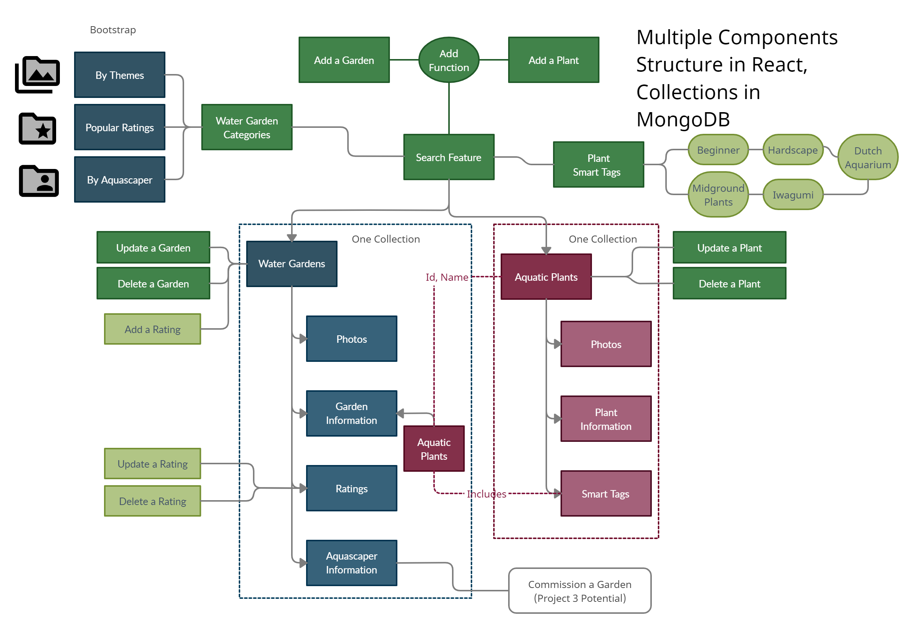
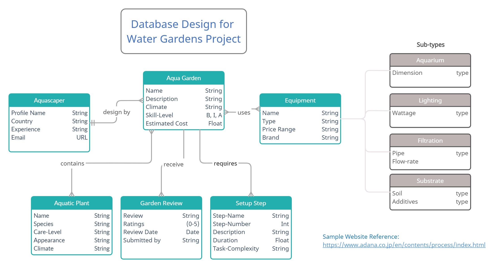
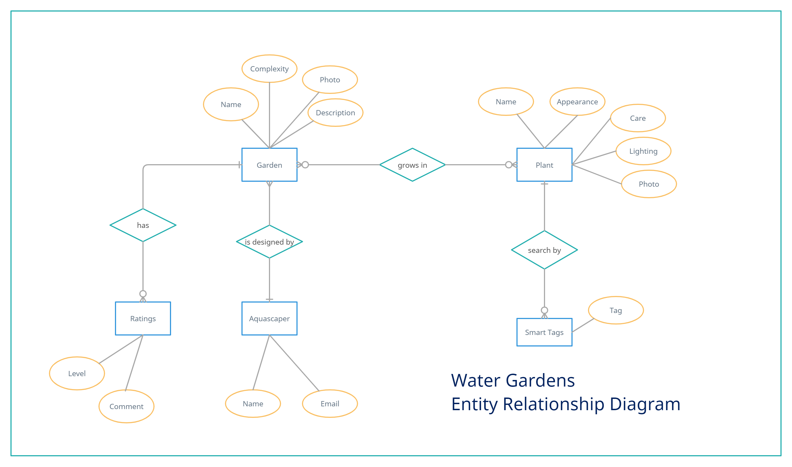

# Water Gardens Gallery Project

This is the front-end development using **React, Express/RESTful API and MongoDB** as its main technologies. This demo project is meant for educational purposes under the Trent Global College (Singapore).

**Web App** found: https://water-gardens.netlify.app/

This project uses the **Five Planes of UI/UX** approach in designing the web app prior to its full-stack front-end and backend development:
1. Strategy (B2C marketplace extension)
2. Scope (Aquascaping Users)
3. Structure (ERD)
4. Skeleton (Navigation & DB Design)
5. Visual (Bootstrap Tabs, Mobile First)

## B2C Business Strategy
This project is considered for its possible extension to TGC Project 3 in the form of creating a marketplace for hobbyists and sellers in a niche area.  

The potential products and services related to the hobby as well as the key players in this industry have been considered for the lack of an integrated platform for hobbyists to source for materials, equipments and its FMCG goods such as plants and fishes. 

With more interests in the aquascaping hobby globally and it is seen as a premium hobby in developed cities, the value of the web app has the potential to grow if it is done well, as part of overall business strategy, which would include marketing, operations, etc.

## Water Gardens Background
The Water Gardens Gallery is a public and free platform for hobbyists to feature their aquascaping aquariums as part of the market analysis (demands) and to create the initial user base.

The main feature in the initial phase is for reviewing of aquariums by hobbyists from beginners to advanced hobbyists or professionals.

## Objectives & Scope: 
It features a listing of aquascaping aquariums and a repository of aquatic plants that are usually used for aquascaping. Users can submit their aquariums and the plants they used for sharing. 

### Business Use Cases

#### **Open platform for reviews and ratings**
Other hobbyists or public can give ratings and feedback on these aquariums and the aquatic plants. 

#### **Potential Advertising Platform**
A potential platform to feature related aquascaping products and services. Suppliers of aquatic plants can share information of the plants and see potential demands.  

#### **Marketplace Potential**
With payment and authentication as enhancements, the platform can be used by hobbyists and enthusiasts to engage services (e.g. commissioning of an aquarium by a professional aquascaper) and to buy/sell related aquascaping products.

## UI/UX Plane
### Design Strategy: Interaction and Information Structure
To maximise the **Single Page Application** (SPA) benefits of React framework, the modular structure of the front-end was initially drawn up:


As the project has potential commercialisation, the **information organisation** with that possibility has been considered early in the development. The DB diagram was drawn up for potential Project 3 which requires the use of a relational database (MySQL):


### Surface: Visual 
The use of **Bootstrap Tabs and Floating Labels** are key features to navigate between the React Stateless Components as well as to optimise screen-space in the Mobile-First design approach respectively.
 *Image from https://www.jquery-az.com/*


 *Image from codepen.io*


## Main Technologies Used
### React
#### **Managed Components**
The main component *WaterGardens.js* serves as the main Parent/Provider of the state variables needed by the Child Components.  It also provide the navigation controls between the components via the use of Bootstrap tabs.

#### Reusability:
The Child Components are mainly for rendering purpose. Some Child Components are shared as "siblings" such as *PopupConfirmDelete.js* to provide UI for deleting Plant or Garden.

#### Modularity: 
*Header.js* and *Footer.js* is shared across the Components, with Footer.js also featuring a "Refresh Data" functionality for user to manually trigger a full refresh of the components' listings and information from the database, to minimise API calls to the backend server.

### UI Libraries
**Bootstrap** 5.0 CSS/HTML (without javascript plug-in), **FontAwesome** and **Google Fonts** were used for the front-end components.

App.css is the main styling file for the **mobile-first** design approach.

## Testing
The Front-end test use cases can be found in the PDF document "Test Cases for Water Gardens Gallery" in this folder [Test Cases](./test-cases-water-gardens.pdf).

Testing is done in Gitpod before it is build and deployed in Netlify.

## Source Files Organization
Source codes for the React front-end are stored in GitHub repository:
https://github.com/haryati75/TGC-Project2-WaterGardensFE

Development is done on Gitpod and is linked to the above GitHub repository for commit/push of code updates.

Two main folders are used: 
1. **components** - for custom components <*.js> with main components
2. **assets** - for image files such as logo

## Deployment
Front-end service is deployed at Netlify using:
```
yarn build
```
Build folder is downloaded and moved to Netlify via the "Deploys" drag-drop method.

Gitpod starting of server and connecting to DB on npm:
```
npm install -g nodemon
nodemon index.js
```
Custom environment variables is not used for the front-end.

.gitignore contains:
```
.env
node_modules
package-lock.json
build
```
Dependencies: 
```
yarn add express
yarn add cors
yarn add mongodb
yarn add axios
yarn add dotenv
```

## Database and Backend integration via RESTful APIs
The information for the Water Gardens is captured in MongoDB database. Database is hosted in MongoDB Atlas.

The integration to the database is via RESTful APIs developed in Express. The Express backend is hosted in Heroku on its free plan.  Performance may be affected due to limited dyno hours under the free plan.

The ERD diagram suitable for the non-relational MongoDB database is shown here:


More information on the backend including the API calls can be found here:
https://github.com/haryati75/TGC-Project-2-Water-Gardens-BE

## Background and Credits
I am an aquascaping enthusiast and admires beautifully crafted and lovingly maintained aquascape aquariums. The following credits go to the below established industry experts that inspires the development of this demo website for my school's project. 

Contents are sourced from the following websites:
1. Aquatic Plants info from **All Ponds Solutions** - one of the UK’s leading online aquatics retailers. Their products and services are one of the most extensive ones that can be found online.
    https://www.allpondsolutions.co.uk/aquarium/plants/

2. Aquascaping Aquariums info from **Tropica Aquarium Plants A/S** - one of Europe and Denmark's leading supplier of aquatic plants. 
>Tropica Aquarium Plants rolled out its first plant in May 1970, 50 years ago. Created by a passionate hobbyist, Holger Windeløv and pushed into the future by a dedicated corporate group, JPS Clemens, Tropica Aquarium Plants now services a global community of aquarists. 
    https://tropica.com/en/inspiration/

3. Aquascaping process and equipments info from **ADA Nature Aquarium** - a premium retailer of aquascaping equipments and aquariums.  
>Founder Amano Takashi incorporated ecosystem and other elements found in nature to aquatic plant layout and established his own unique style called “Nature Aquarium”. In 1982, Amano founded Aqua Design Amano. The company attracted much attention for its aquarium equipment “Nature Aquarium Goods” featuring excellent quality and design. 
    https://www.adana.co.jp/en/contents/process/index.html


## Developed by: 
### Haryati Hassan
For Trent Global College, Singapore

GitHub: haryati75

June 2021
